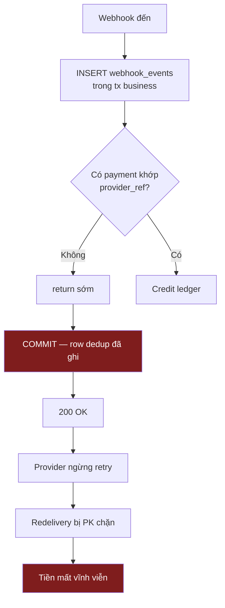
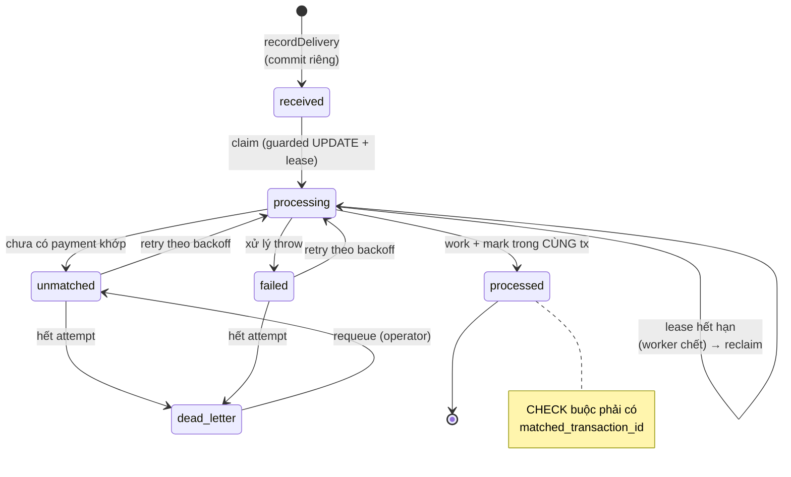
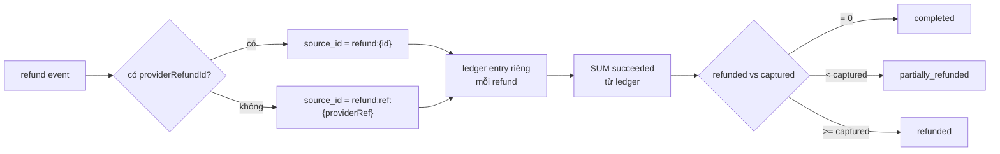
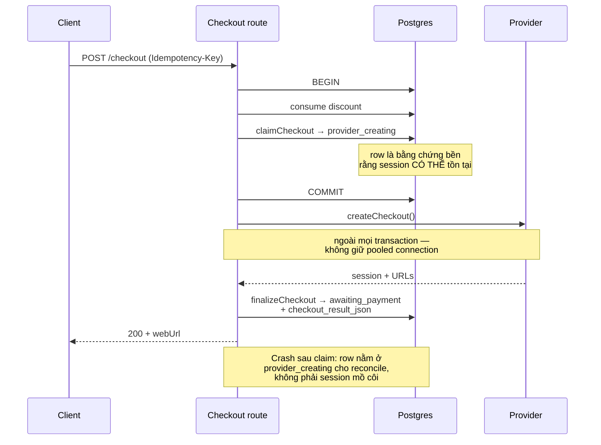
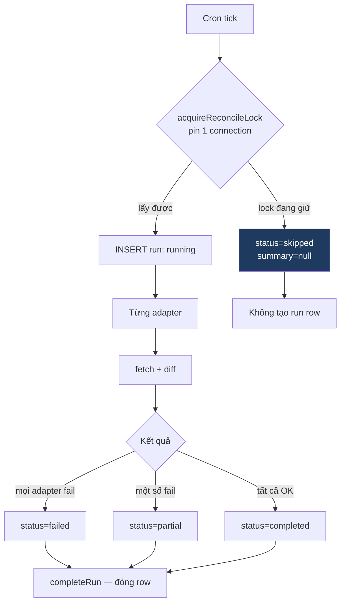
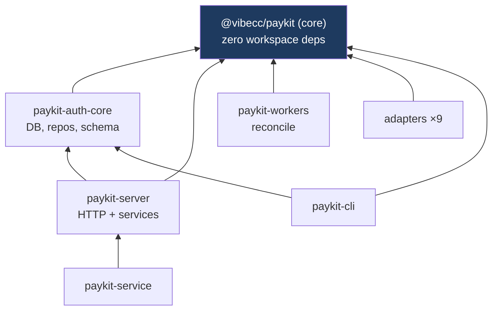

# Payment orchestration hardening — kết quả

Nhánh tích hợp: `hardening/payment-orchestration` (51 commit trên `main`, 131 file,
+13.617/−776). Chưa merge vào `main`.

Trạng thái gate trên đúng nhánh tích hợp, chạy thật:

| Lệnh | Kết quả |
|---|---|
| `pnpm install --frozen-lockfile` | exit 0 |
| `pnpm typecheck` | exit 0 |
| `pnpm build` | exit 0 |
| `pnpm test` | exit 0 — **1374 pass / 23 skip / 145 file** (không có Postgres) |
| `pnpm test` + `PAYKIT_E2E_DATABASE_URL` | exit 0 — **1397 pass / 0 skip / 145 file** (Postgres 17 thật) |
| `pnpm lint` | exit 1 — **219 error** |

`pnpm lint` fail là trạng thái có từ trước, không phải do workstream này: baseline
lúc bắt đầu là 230–238 error trên cùng script (`biome check packages`). 219 là thấp
hơn baseline. Mọi file mới/đã sửa trong workstream đều lint sạch — kiểm riêng 26 file
F5: `Checked 26 files. No fixes applied.` Không suppress rule nào, không nới `any`,
không giảm coverage.

Test lúc bắt đầu session: 1078 pass. Hiện tại 1374, +23 file test mới.

---

## 12 mục tiêu — trạng thái

| # | Mục tiêu | Trạng thái | Nằm ở đâu |
|---|---|---|---|
| 1 | Idempotency checkout end-to-end | Xong | `claimCheckout`/`finalizeCheckout`, migration 025 |
| 2 | Webhook inbox bền, chịu được webhook đến trước khi link checkout | Xong | migration 026, `webhook-delivery-processor.ts` |
| 3 | Semantics refund một phần / nhiều lần | Xong | bảng `refunds`, `refundedPaymentStatus` |
| 4 | Map refund Stripe đúng | Xong | `stripe-adapter/src/webhook-events.ts` |
| 5 | Advisory lock an toàn dưới pool | Xong | `advisory-lock.ts` pin vào 1 connection |
| 6 | Pagination/timeout/retry/status cho reconcile | Một phần | status model xong (migration 023); cursor pagination **chưa** (027) |
| 7 | Invariant tiền tệ / số tiền / trạng thái | Xong | migration 019+020, `usd-native.ts`, `amount-guards.ts` |
| 8 | Không gọi compliance khi đang giữ tx/row lock | Xong | `screening_jobs` + park, migration 021 |
| 9 | Fencing token cho idempotency claim | Xong | migration 024, `claim_token` + `claim_generation` |
| 10 | Test đủ các failure window | Phần lớn | 23 file test mới; xem "Còn thiếu" |
| 11 | Giữ pattern/convention repo | Xong | guarded UPDATE, repo-per-domain, kebab-case, manifest migration |
| 12 | Không hack / monkey patch / nợ kỹ thuật | Xong | không có suppress, không có test bị tắt |

Mục 6 là mục duy nhất **cố ý** chưa xong hết — chi tiết ở cuối.

---

## Lỗi mất tiền đã sửa

Bốn lỗi dưới đây đều verify được từ source, không phải suy đoán.

### 1. Webhook đến trước `provider_ref` ⇒ mất tiền vĩnh viễn

`webhook_events` có PK `(provider, event_id)` và router INSERT nó làm câu lệnh **đầu
tiên** của transaction business. Một row mang hai nghĩa cùng lúc: "đã thấy" và "đã
xử lý". Mọi `return` sớm vì lý do business — quan trọng nhất là *không tìm thấy
payment nào có provider_ref này* — vẫn commit row dedup, trả 200, provider ngừng
retry, và redelivery sau đó bị PK từ chối.

Khách đã trả tiền, ledger trống, payment đứng mãi. Không log, không metric, không
đường replay.

Sửa: tách nhận và xử lý thành hai transaction. Nhận commit riêng; state của row nói
xử lý tới đâu.

Điểm then chốt: `markDeliveryProcessed` nằm **trong** transaction làm việc, nên
"đánh dấu xong" và "thật sự xong" không thể lệch nhau. Rollback mang cả hai đi.

### 2. Refund một phần đặt payment thành `refunded`

Đường webhook và đường admin tính tổng đã refund từ hai nguồn khác nhau, và một
refund một phần đủ để đặt status `refunded` — payment đọc như đã hoàn toàn bộ dù
mới hoàn một phần. Ledger dùng `providerRef` làm `source_id`, nên refund thứ hai
trên cùng payment bị UNIQUE constraint gộp vào refund thứ nhất: **tiền hoàn lần 2
không bao giờ vào ledger.**

Sửa: bảng `refunds` với identity riêng (`provider_refund_id`), `source_id` của ledger
đổi sang `refund:<id>`, và một hàm duy nhất `refundedPaymentStatus(captured, refunded)`
quyết định status cho cả hai đường.

### 3. Advisory lock session-level qua connection pool

`pg_advisory_lock` là session-level, nhưng hai query độc lập qua `pg.Pool` có thể
rơi vào hai connection khác nhau — lock lấy ở connection A, unlock gọi trên
connection B. Lock không bao giờ được thả, hoặc hai reconcile chạy song song.

Sửa: `acquireReconcileLock` lấy connection từ `db.$client` và pin cả lock lẫn unlock
vào đúng connection đó; unlock thất bại thì `client.release(true)` để destroy
connection thay vì trả về pool với lock còn treo.

### 4. Checkout crash giữa lúc gọi provider ⇒ session mồ côi

Thứ tự cũ: commit payment row → gọi provider → ghi `provider_ref` về. Chết ở giữa
để lại một checkout session sống ở provider mà DB này không gọi tên được. Webhook
của nó khớp zero row → chính là lỗi #1.

Sửa: claim trước, gọi provider sau.

Claim là insert-first `ON CONFLICT DO NOTHING`: hai request đồng thời cùng key cho ra
**một** checkout — bên thua đọc row của bên thắng, thay vì ăn unique-violation 500
làm key đó không dùng lại được bao giờ.

Mất claim thì throw để rollback cả transaction — nếu return bình thường, discount đã
consume sẽ commit và promo của khách bị tiêu cho một checkout không hề được tạo.

---

## Reconciliation

Trước đây `skipped` bị gộp thành `completed`, nên một lock giữ suốt đọc như
"reconcile thành công, không có discrepancy". Bốn status giờ phân biệt được, và `run`
được hoist ra ngoài `try` với catch đóng row — trước đó một throw để lại row đứng
`running` mãi.

---

## Package dependency sau refactor

Ranh giới này ràng buộc một quyết định thật: `drainWebhookInbox` **không** đặt ở
`packages/workers` như thiết kế ban đầu. `workers` chỉ depend core, không có
auth-core, nên không đọc được repo inbox — thêm dependency đó sẽ phá test
`no-cross-imports.test.ts`. Drain vì thế nằm cạnh `drainScreeningJobs` trong
`packages/server/src/services`, cùng dạng "gọi từ cron", export qua barrel.

---

## Migration đã thêm

| # | Slug | Nội dung |
|---|---|---|
| 019 | `money_integer_micros` | `NUMERIC(20,6)` → `NUMERIC(30,0)` + pre-check fail-loud |
| 020 | `money_and_currency_invariants` | CHECK amount > 0 / <> 0 + ISO-4217 shape |
| 021 | `screening_jobs` | status `screening_pending` + queue table |
| 022 | `refunds` | bảng `refunds` + `partially_refunded` + backfill 2 nguồn |
| 023 | `reconciliation_run_status` | thêm `partial`, `skipped` |
| 024 | `idempotency_claim_token` | `claim_token` + `claim_generation` (fencing) |
| 025 | `checkout_lifecycle` | `provider_creating`, `awaiting_payment`, `checkout_result_json` |
| 026 | `webhook_inbox` | bảng inbox + 4 partial index + backfill |

Mọi migration có `.up.sql`, `.down.sql`, entry trong `manifest.json`, mirror
byte-identical sang `packages/cli/migrations` (assert bằng test), và một shape test
riêng. Tên file và comment SQL không tham chiếu số phase hay mã finding.

---

## Bảo mật

Ràng buộc user đặt ra, và chỗ thực thi:

- **Không log/lưu secret.** `raw_payload` đi qua `redactRawBody` trước khi ghi: Stripe
  `sk_live_`/`sk_test_`, `whsec_`, Bearer token, số dạng thẻ, email. Có 12 test riêng
  (`webhook-payload-redaction.test.ts`).
- **Hash lấy trên bytes gốc, lưu cột riêng.** Nếu hash tính từ bản đã redact thì hai
  secret khác nhau sẽ redact ra cùng text và hash giống nhau — body bị đổi sẽ lọt.
  Test assert đúng tính chất này.
- **Không lưu secret trong idempotency response cache.** Không thay đổi; cache vẫn
  chỉ giữ response body của chính API.
- **Body quá lớn bị cắt** (64 KiB) nhưng hash vẫn phủ toàn bộ.
- **Payload có retention.** `sweepInboxPayloads` xoá `raw_payload` của row đã settle
  quá 30 ngày, giữ lại row. Chỉ quét row terminal — xoá payload của delivery còn nợ
  retry sẽ phá chính khả năng retry.
- **Listing không kéo payload.** `listDeliveriesByState` select cột tường minh, không
  có `raw_payload`/`normalized_payload`, để endpoint operator không thành bulk export.
- **Không có gì chưa xác thực vào được inbox.** Verify signature/parse xảy ra *trước*
  `recordDelivery`. Ngược lại thì bất kỳ ai cũng cắm được row vào một bảng bền.
- **Provider error không leak ra client.** Checkout thất bại trả 502 với message
  cố định; test assert message của provider không xuất hiện trong response.

Không có secret, dotenv, hay credential nào được commit.

---

## Còn thiếu — nói thẳng

**Mục tiêu 6 chưa xong phần pagination.** Status model, lock, retry, timeout đã có.
Cursor pagination cho reconcile (migration 027, `cursor_json` + `provider`) chưa làm.
Hệ quả thực tế: reconcile vẫn fetch theo cửa sổ thời gian, nên với tenant có lượng
giao dịch rất lớn một run có thể chạy dài hơn mong muốn. Không mất tiền, không sai
số — chỉ là chưa chia trang.

**Đã verify trên Postgres 17 thật.** Cả 26 migration apply sạch theo đúng thứ tự
manifest lên database trống. `webhook-inbox-pg.e2e.test.ts` (14 test) chạy repo inbox
thật qua `pg.Pool` và assert những thứ mock không chứng minh được:

- Hai `claimNextDelivery` đồng thời cho ra **đúng một** winner — đo bằng
  `Promise.all`, không phải suy ra từ pattern.
- Lease hết hạn thì row được reclaim, `processing_attempts` lên 2 — worker chết
  không làm delivery đứng mãi.
- Cả 4 CHECK constraint thật sự reject: `processed` không có
  `matched_transaction_id`, `unmatched` mang `processed_at`, `dead_letter` thiếu
  `processed_at`, state sai chính tả.
- Vòng `unmatched → failed → dead_letter → requeue` đi hết không vi phạm CHECK nào
  (requeue phải clear `processed_at`, nếu không constraint chặn).
- `sweepInboxPayloads` xoá payload của row đã settle và **không** chạm row còn nợ retry.
- `listDeliveriesByState` không trả về `rawPayload`/`normalizedPayload`.

Với `PAYKIT_E2E_DATABASE_URL` trỏ vào DB trống: **1397 pass, 0 skip, 145 file** —
cả ba pg e2e (inbox, cold-start, discount savepoint) cùng chạy.

**`webhook_events` vẫn còn.** Router payment không dùng nữa, nhưng
`/admin/webhook-events` và pipeline subscription vẫn đọc. Giữ lại có chủ đích: down
migration của 026 cần chỗ đó còn dữ liệu để quay về. Nghĩa là pipeline subscription
**chưa** được hưởng inbox — nó vẫn có đúng lỗi #1. Chưa nằm trong scope 12 mục tiêu,
nhưng là nợ đã biết.

---

## Chạy được ngay sau deploy

`drainWebhookInbox` và `drainScreeningJobs` **phải** được gọi từ cron/worker tick.
Không gọi thì delivery `unmatched` không bao giờ được retry và payment
`screening_pending` đứng mãi — đúng lỗi mất tiền cũ, chỉ khác là giờ nhìn thấy trong
bảng. Cả hai đã export qua barrel của `paykit-server` và có comment nói rõ yêu cầu
này ở chỗ export.

Metric mới nên gắn alert: `paykit_webhook_dead_letter_total` (tiền có thể đã chuyển ở
provider mà không khớp được gì ở đây — cần người xem),
`paykit_webhook_payload_mismatch_total` (một event_id với hai body khác nhau).
